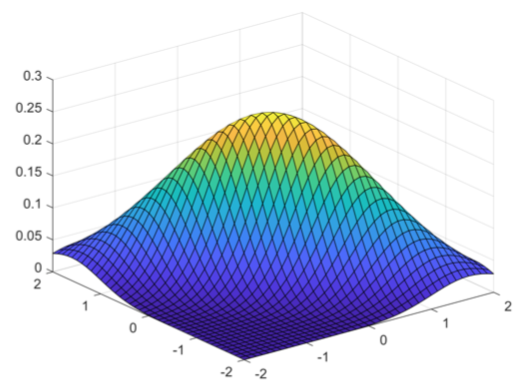
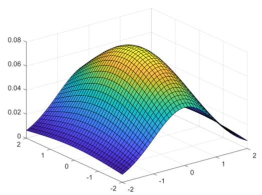
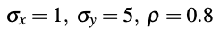

# Probability_and_Statistics_Models
Implementation of different basic probability and statistics models.

<h2>Random Fibonacci Series</h2>

The Random Fibonacci Series is calculated with the expression below, where Beta is a discrete random variable which gets the value of +1 or -1 with equal probabilities. It has been proved that the absolute value of this series converges to α^n. 

$lim(1+\frac{1}{n}\)^{n}$

The **95% confidence interval** for α:

```ruby
def fibonacci(n):
    l=[-1,1]
    B=np.random.choice(l)
    if n < 0:
        print("incorrect input")
    elif n == 0:
        return 0
    elif n == 1 or n == 2:
        return 1
    else:
        print
        return fibonacci(n-1) + B*fibonacci(n-2)
```

```ruby
for i in range(num):
    Xi=np.abs(fibonacci(N))
    Xi=Xi**(1/N)
    summ+=Xi
    sample.append(Xi)
M=summ/num
S=0
for i in range(num):
    S+=(sample[i]-M)**2/(num-1)
S=S**0.5
```

The result:

```
CI=[ 1.102852823326828 , 1.237871185627803 ]
```

Assuming that the maximum value in this series is fmax, with an **exponential distribution**. Estimating the value of Lambda in this distribution:

```ruby
def fib_max(n):
    a = 0
    b = 1
    summ = 1
    count = 1
    fib_=[]
    l=[-1,1]
    while(count <= n):
        fib_.append(summ)
        a = b
        b = summ
        B=np.random.choice(l)
        summ = a + B*b
        count += 1
    return max(fib_)
```

The result:

```
0.016825103053756205
```

Estimating the value of Lambda with the histogram of the distribution:

```ruby
plt.hist(plot_sample,bins=20,density=True,range=[0,200])
def f(x): 
    return (lambda_*math.exp(-1*landa*x))
```

Comparing the results above:


<h2>Girko Circular Law</h2>

The Girko Circular Law in probability states that the eigenvalues in a n x n matrix where the entries are **i.i.d.** values from a **normal distribution** with a mean of 0 and std of 1/n, converge inside a circle of radius = 1, if n goes to infinity.

Studying this law by plotting different **normal** and **uniform** distributions for different values of n:

Normal:

```ruby
M[i][j]=np.random.normal(0,1/(n**0.5))
eig_value,eig_vect=np.linalg.eig(M)
```


Uniform:

```ruby
def Girko (n):
    for num in range(100):
        M=np.zeros((n,n))
        for i in range (n):
            for j in range (n):
                M[i][j]=np.random.uniform(-(3/n)**0.5,(3/n)**0.5)
        eig_value,eig_vect=np.linalg.eig(M)
        X=[x.real for x in eig_value] 
        Y=[x.imag for x in eig_value]
```


We see that the statement holds true.

<h2>Estimation of Napierian number with Monte Carlo method</h2>

The Napierian number is the limit below:


The goal is to estimate this number with the Monte Carlo method. First, we consider the curve and the rectangle below:


According to the **law of large numbers**, the proportion of the rectangle's area behind the curve to the total area, is equal to the number of points under the curve below to the total of them:


So the Napierian number can be estimated with Monte Carlo method. Assuming than n = 100, the results are as below:

```ruby
def nepper_calculator(n):
    i=1
    summ=0
    for i in range (n):
        x=np.random.uniform(0,1)
        y=np.random.uniform(math.exp(-1),1)
        if (y<math.exp(-x)):
            summ+=1
    S_total=1*(1-math.exp(-1))
    S=(summ/100)*S_total
    nepper=2/(1-S)
    return nepper
```

The result:

```
2.710593651084598
```


<h2>Euler-Mascheroni Constant</h2>

The goal is to show that the expression below converges to the value of 0.5772 (the Euler-Mascheroni constant)


```ruby
while (n<=500):
    sum_ep=0
    r=1
    while(r<=n):
        x=float(n/r)
        y=math.ceil(x)
        ep=y-x
        sum_ep+=ep
        r+=1
    if(n==1):
        epsilon.append(0)
    else:
        epsilon.append(float(sum_ep/(n-1)))
    n+=1
````
The results below show the convergence:


The error is computed with the expression below:


```ruby
while (n<=500):
    r1=np.random.randint(1,n)
    x=float(n/r1)
    y=math.ceil(x)
    ep1=y-x
    epsilon1.append(ep1)
    r2=np.random.randint(1,n+1)
    x2=float((n+1)/r2)
    y2=math.ceil(x2)
    ep2=y2-x2
    epsilon2.append(ep2)
    n+=1
```
The results:


<h2>Poisson Distribution</h2>

Implementing a Poisson distribution for the number of people riding a bus. Consider that number of people who get on a bus comes from a Poisson distribution, and that 3 people get on a bus per minute on average. Estimate the distribution for a timeline of a 100 days.

The distribution was estimated using the Numpy library as below:

```ruby
x_poisson=np.random.poisson(lam = 3,size = 1000)
    x_avg=sum(x_poisson)/1000
```

The result is as follows:


<h2>Independant Uniform Distributions</h2>

Assuming that X, Y are independant and come from a distribution of U[0,1], the following expressions were computed:


```ruby
if( X**2 + Y**3 > 0.75 ):
        n+=1
```


```ruby
if( X + Y > 5 * X  * (Y**(0.5))):
        n+=1
```


Monte Carlo:

```ruby
for i in range (1000):
    Xn=np.random.uniform(-1,1)
    sum+=f(Xn)
    y.append((b-a)*sum/(i+1))
```

Result:


Monte Carlo:

```ruby
for i in range (1000):
    Xn=np.random.uniform(0,1)
    sum+=f(Xn)
    y.append((b-a)*sum/(i+1))
```

Result:


Monte Carlo:

```ruby
for i in range (5000):
    Xn=np.random.uniform(0,3)
    sum+=f(Xn)
    y.append((b-a)*sum/(i+1))
```

Result:


<h2>Normal and Exponential Distribution</h2>

These two distributions were implemented by using the **inverse of the cumulative distribution** and the **uniform distribution**:

Exponential:

```ruby
def exp_inverse(Fx):
    x=-np.log(1-Fx)
    return x
    
for i in range (100):
    Fx=np.random.uniform(0,1)
    x_exp=exp_inverse(Fx)
```


Normal:

```ruby
def norm_inverse(Fx):
    from scipy.stats import norm
    x=norm.ppf(Fx)
    return x

for i in range (100):
    Fx=np.random.uniform(0,1)
    x_norm=norm_inverse(Fx)
```


<h2>Correlation Coefficient:</h2>

Using Mesh in MATLAB, the following graphs are for **normal distributions** with means of 0, and stds and correlation coeeficients as below:

<h2>1)</h2>

```
normal_distribution=n(0,1,1,x,y);
surf(x,y,normal_distribution)
```


<h2>2)</h2>

```
normal_distribution=n(0.8,1,1,x,y);
surf(x,y,normal_distribution)
```


<h2>3)</h2>

```
normal_distribution=n(-0.8,1,1,x,y);
surf(x,y,normal_distribution)
```




<h2>4)</h2>

```
normal_distribution=n(0,1,2,x,y);
surf(x,y,normal_distribution)
```




<h2>5)</h2>

```
normal_distribution=n(0.8,1,2,x,y);
surf(x,y,normal_distribution)
```


<h2>6)</h2>

```
normal_distribution=n(0.8,1,5,x,y);
surf(x,y,normal_distribution)
```


<h2>Estimation of Pi:</h2>

By generating random points for (x,y) in a uniform distribution inside a square of 1x1, the goal is to find the points which fall into the circle with area of Pi. The model is like this:


Implementation of the problem above with total number of generated points equal to 100, 1000, 10000, 100000:

```ruby
def estimation(n):
    in_circle=0
    for i in range (n):
        x=np.random.uniform(0,2)
        y=np.random.uniform(0,2)
        if((((x-1)**2+(y-1)**2)**(0.5))<1):
            in_circle+=1
    return (float(in_circle/n))
```

The results are as below:

```
number of points = 100
Pi = 3.16
accuracy = 0.005859240340778607

number of points = 1000
Pi = 3.128
accuracy = 0.0043266760171027045

number of points = 10000
Pi = 3.1308
accuracy = 0.0034354083357881885

number of points = 100000
Pi = 3.1462
accuracy = 0.0014665639114422135
```

<h2>Heights of people in a class</h2>

A total number of k people are in a class. Their heights varies between 1 to 320, and only consists integer values. What value should k have, so that two people have the same height with the probability of p = 0.5?

The problem was solved both by using the mathematical formula and the python libraries, and the results where the same, and as follows:

The mathematical view:

```ruby
i = 1
while (i < 60):
    probability.append(1-(math.factorial(320)/((math.factorial(320-(i+1)))*(320**(i+1)))))
    i=i+1
```

Result:


The programming view:

```ruby
or i in range(59):
    favorable=0
    for j in range(99):
        classes=[]
        for k in range (i+2):
            classes.append(random.randint(1,320))
        classes.sort()
        for k in range (i+1):
            if(classes[k]==classes[k+1]):
                favorable+=1
                break       
    probability.append(favorable/100)
```

Result:


